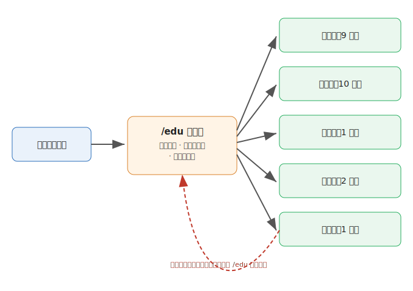
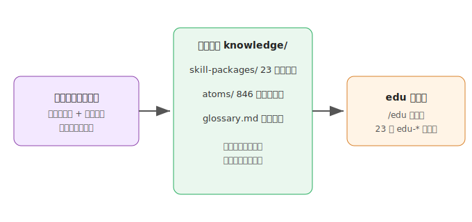

# edu（拾元·儿童成长工具箱）

把说不清、推不动、需要判断或整理的真实育儿 / 教学任务，变成当前可以继续推进的一步。

edu 由拾元创建，覆盖 0-9 岁儿童的成长、启蒙与教育，内置 846 个知识原子与 23 个 Skill。面向教师和家长，给方法也讲原理。

适用于任何有真实育儿 / 教学任务需要推进的人。你可以交付问题、材料、目标、选择或持续卡点，edu 会根据当前信息调用合适的 Skill。

**最新版本：v0.7.0**

已有用户可执行：

```bash
npx -y skills add shiyuanecho/eduskill -g --all
```

[新手从这里开始](docs/新手入门.md) · [查看全部 Skill](docs/新手入门.md#skill-全目录) · [安装 edu](#安装)

## 你可以用它做什么

| 你交付的内容 | edu 会帮你做什么 |
|---|---|
| 一个还没想清楚的问题 | 看清孩子卡在哪、属于哪个发展维度，找到当前需要判断的结点 |
| 一段需要处理的内容或材料 | 判断是不是真启蒙，或给出能玩的活动、讲法、话术 |
| 一个需要判断的目标或选择 | 把模糊愿望审计成可检查的收获，或在课程 / 资源间做不后悔的选择 |
| 一件推进不下去的任务 | 找到行为 / 习惯 / 沟通上的卡点，给出能实际开始的动作 |
| 一批需要长期记录的材料 | 建成可检索、可回看的成长档案 |
| 一个需要持续跟踪的孩子 | 保存观察、追加记录、形成跨会话的成长档案 |

## 从第一次提问开始

安装后，第一次使用直接输入：

```text
/edu 新手入门
```

edu 会说明你可以交付什么、系统怎样工作、可能得到什么结果。你提交真实任务后，它会选择合适的 Skill；每次只决定当前一步，后续方向由实际结果决定。

你也可以直接输入 `/edu`，然后提交任何真实任务：

```text
我家娃 4 岁，数数能数到 20，但让他拿 3 个积木总拿不准，是数感没起来吗？
这段绘本想请你看看是不是真启蒙：……
我在几个思维课之间犹豫，该选哪个？
这件事一直推进不下去：娃晚上不肯睡。
```

`/edu` 会读取当前对话里已有的信息，自动选择当前最合适的一个 Skill。需要完整示例和每个 Skill 的说明时，阅读 [edu 新手入门](docs/新手入门.md)。



已经知道要做什么时，可以直接调用：

```text
/edu-diagnosis 我做中班老师，几个孩子总是不会轮流玩，是社交问题还是规则没建立？
/edu-lesson 我想让 3 岁娃认识颜色，怎么设计一个启蒙活动？
/edu-talk 陪娃读绘本时，我该怎么提问才能引发他思考？
```

## 作者

作者：拾元（edu 儿童成长工具箱创作者，专注 3-9 岁儿童成长与启蒙领域）。

## 安装

### Codex、Claude Code、WorkBuddy 与其他支持 Skills 的 Agent

```bash
npx -y skills add shiyuanecho/eduskill -g --all
```

已经安装 edu 后，直接对 Agent 说「更新 edu」。Agent 会同步官方 edu；你不需要复制更新命令。

### Claude Code 插件市场

```bash
claude plugin marketplace add shiyuanecho/eduskill
claude plugin install edu@shiyuanecho-eduskill
```

本地构建时运行：

```bash
bash tools/build-skills.sh
```

产物位于 `dist/eduskill-<VERSION>.skill`（zip，含 SKILL.md、skills/、knowledge/、docs/、.claude-plugin/）。

## 常见场景与当前入口

edu 每次只解决当前最关键的一步。完成后输入 `/edu`，它会读取刚才的结论和你的新反馈，再推荐下一步；后续动作不预先排成固定链条。

### 判断一个孩子卡在哪

```text
/edu-diagnosis
```

先诊断学力或行为卡点。诊断结论可能提示你设计活动、练习陪玩话术，或回到行为情绪看根子；由 `/edu` 结合当前结论判断。

### 从零开始做启蒙

```text
/edu
```

说清孩子年龄、你关注什么。`/edu` 会选择当前需要的一个相关 Skill；活动、讲法、话术、常规会在不同结果下进入。

### 把目标变成教案/活动

```text
/edu-lesson
```

把目标变成可上的教案或可玩的活动。做完后下一步可能是记一笔或存进档案。

### 家长的一条焦虑

```text
/edu-anxiety
```

先判断这条焦虑合不合理。结论会指出当前更优先理清目标、做选课决策，还是盘体系。

### 给一个孩子建成长档案

```text
/edu-archive
```

先把观察与结论存成文件。后续行动根据档案内容和当前任务重新判断。

## 直接调用的 Skill

edu 当前正式发布 23 个 Skill。下面按用户目标列出入口；

| 目标 | 直接调用 |
|---|---|
| 不知道从哪里开始，或完成一轮工作后找下一步 | `/edu` |
| 判断学力 / 行为 / 内容 / 焦虑 / 目标 / 体系 | `/edu-diagnosis`、`/edu-behavior`、`/edu-content`、`/edu-anxiety`、`/edu-aim`、`/edu-benchmark` |
| 设计教案 / 活动 / 亲子话术 | `/edu-lesson`、`/edu-talk` |
| 班级日常管理 | `/edu-classroom` |
| 家庭日常管理（作息/屏幕/规则/陪伴） | `/edu-family` |
| 家园协作与衔接（选园/衔接/家长会） | `/edu-connect` |
| 在课程 / 资源间做选择 | `/edu-decision` |
| 记录一次变化、建长期档案 | `/edu-report`、`/edu-archive` |
| 备课 / 写教案 / 写评语 | `/edu-lesson`、`/edu-comment` |
| 观察评估 / 融合支持 | `/edu-observe`、`/edu-inclusive` |
| 教师专业成长（教研/反思/培训） | `/edu-teachdev` |
| 分龄发展养育指南 | `/edu-ages` |
| 0-3 岁家庭养育实务 | `/edu-infant` |
| 家庭陪学方法（拼读/数学/书写） | `/edu-tutor` |
| 发展科学与脑科学 | `/edu-grow` |
| 多端桥接 | `/edu-bridge` |

## 知识库

项目公开了 846 条结构化知识原子、按领域整理的方法论知识包和高频概念词典。你可以安装整套 Skill，也可以单独取用其中一部分。



- 想了解字段、主题和数据范围，阅读 [原子库说明](knowledge/atoms/)。
- 想给自己的 AI 加儿童成长专业能力，使用 `knowledge/skill-packages/` 下的方法包作为系统提示词背景。
- 想看领域高频概念索引，浏览 [高频概念词典](knowledge/glossary.md)。

## 进阶使用

### 成长档案

对话关闭后，当前上下文不会自动保留。需要跨对话继续时：

```text
/edu-archive 给乐乐建一份成长档案
```

档案默认位于当前工作目录下的 `edu-档案/{孩子代号}.md`，每次更新为追加，不覆盖历史。完整规则见 [新手入门中的档案说明](docs/新手入门.md#skill-全目录)。

## 更新

已经安装 edu 后，直接对当前 Agent 说：

```text
更新 edu
```

当前 Agent 没有立即读取到新能力时，新建一次对话后再使用。

版本变更见 [GitHub Releases](https://github.com/shiyuanecho/eduskill/releases)。

当前版本：**v0.7.0**

## 许可证

本项目采用 [CC BY-NC 4.0](https://creativecommons.org/licenses/by-nc/4.0/) 许可证。

- 个人使用、学习、研究、非商业项目：不需要署名，不需要申请。
- 公开发布衍生作品（文章、工具、课程等）：请注明来源（拾元 · edu 儿童成长工具箱）。
- 商业用途：需要单独授权，请联系作者。
